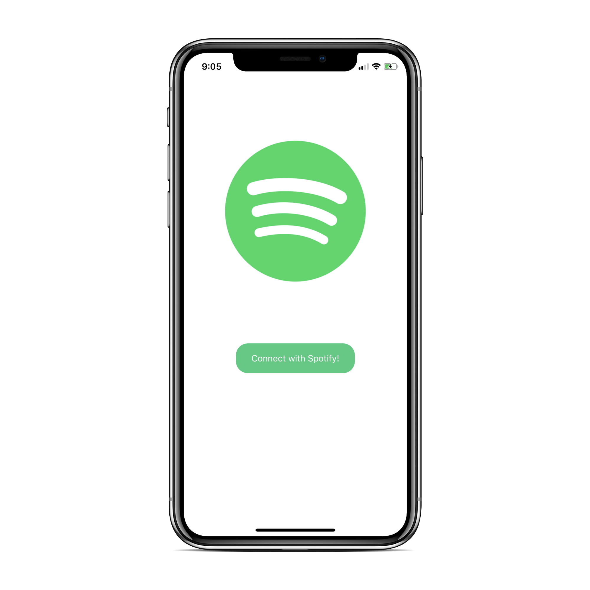
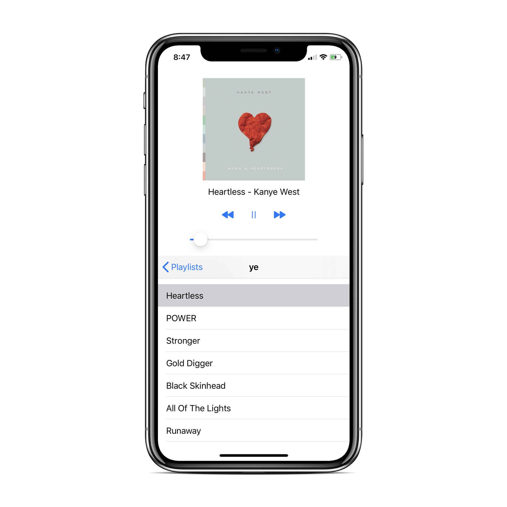

# Spotify Player
### A sample Spotify player iOS application

Uses Spotify's SDK and a Swift Spotify API wrapper forked from <a href="https://github.com/xzzz9097/SpotifyKit" target="_blank">`SpotifyKit`</a> to connect and retrieve data from a Spotify account.

#### Features
* Authenticate with your personal Spotify account
* Display all your playlists and songs
* Player supports playing music and local music control

#### Screenshots

 

#### Setup

Go to the <a href="https://developer.spotify.com/dashboard/login" target="_blank">`Spotify Developer Console`</a> and create a new project to get your client ID and Client Secret, you will need to put these unique keys in ClientKeys.swift to authenticate properly. You will also need to add the redirect URI: spotifykitdemo://callback to the dashboard under "Edit Settings".
